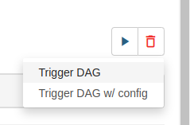

# Airflow Challenge - Indicium [Lighthouse]

This challenge is a task provided by Indicium in order to obtain a Trainee-level skill certification on Airflow platform.

In order to run this project, please follow instructions below:

## Instructions

Note: all commands are using linux platform. If you are using Windows, please find commands corresponding to your operating system.

1. Clone the repository:

```
git clone https://github.com/moise-s/-Lighthouse-Airflow_Challenge.git
```

2. Create a Virtual Environment:

```
virtualenv venv -p python3
```

3. Run the newly-created environment:

```
source venv/bin/activate
```

4. Install the required libraries:

```
pip install -r requirements.txt
```

5. It is necessary to inform the system the location of variable `AIRFLOW_HOME`. So, create on the project root, a file named `.env` containing following text. It is necessary to change path according to your environment:

```
export AIRFLOW_HOME=<path-to-project-root-folder>
```

6. Inform system the location and purpose of file, on terminal:

```
source .env
```

7. Finally, run AirFlow:

```
airflow standalone
```

8. On Terminal, you will find the credentials to run project on `localhost:8080`, as the example:

```
standalone | Airflow is ready
standalone | Login with username: admin  password: GdKc3u5PNE5qZGGG
standalone | Airflow Standalone is for development purposes only. Do not use this in production!
```

## AirFlow Usage

After acessing, on your browser `localhost:8080` and logging in with credentials gotten from terminal, it is possible to check DAGs. Please click on DAG named `DesafioAirflow`. There you can navigate on options. By going to graph option, there is the DAG's flow, as image below:


For running the DAG, click on `play` icon, on top-right of screen, and then `Trigger DAG`.



After Triggering, it should run successfully and the result will be shown on Grid view (green for success!)


## Explaining tasks

1. Connecting to `sqlite` with Northwind database, and exporting some data (`SELECT * from "Order"`) from this DB to a .CSV file named `output_orders.csv`. The function is below:

```
def sqlite_to_csv():
    con = sqlite3.connect('data/Northwind_small.sqlite')
    df = pd.read_sql_query('select * from "order"', con)
    df.to_csv(path_or_buf='data/output_orders.csv')
    con.close()
```

2. Reading data from `OrderDetail` table and writing a file containing a filtered query (from tables `Order` and `OrderDetail`) to a `.csv` file:

- Sum of `Quantity` sold to a `ShipCity = "Rio de Janeiro"`;

So, function with query and file writing is as follows:

```
def sqlite_join():
    con = sqlite3.connect('data/Northwind_small.sqlite')
    df = pd.read_sql_query("""
    select SUM(OrderDetail.quantity)
    from "Order"
    LEFT join OrderDetail
    on "order"."Id" = OrderDetail.orderid
    where "order"."shipcity" = "Rio de Janeiro";
    """, con)
    f = open("data/count.txt", "w+")
    f.write(str(df.values).strip('[]'))
    con.close()
```

Result of function running is file on `data/count.txt` with following content: `1893`.

3. Added my e-mail to the variable `my_email` on AirFlow
   

4. While running last task of DAG, called `export_final_output`, the file `final_output.txt` is created. Its content is:

```
bW9pc2VzLm5hc2NpbWVudG9AaW5kaWNpdW0udGVjaDE4OTM=
```

5. When executing DAG it is important to make sure they are in the correct order. That is, it was necessary to provide following code on `dags/desafio.py` file:

```
export_CSV >> join_count >> export_final_output
```
